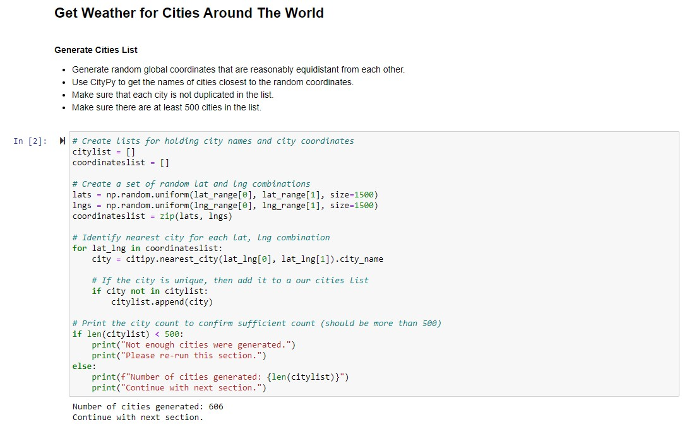
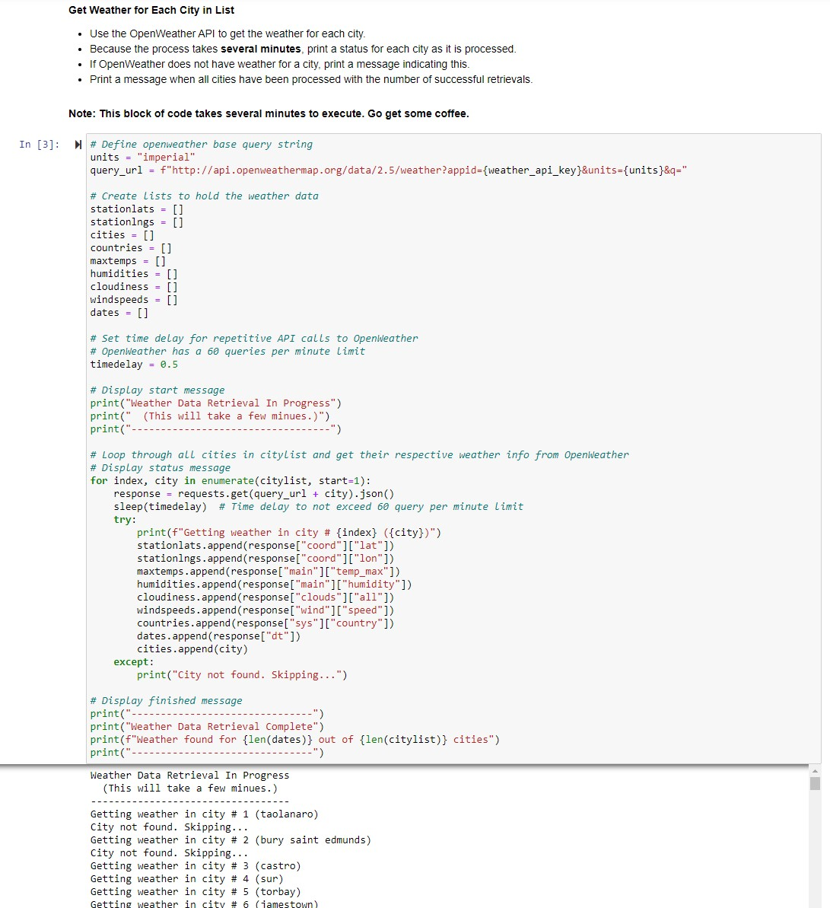
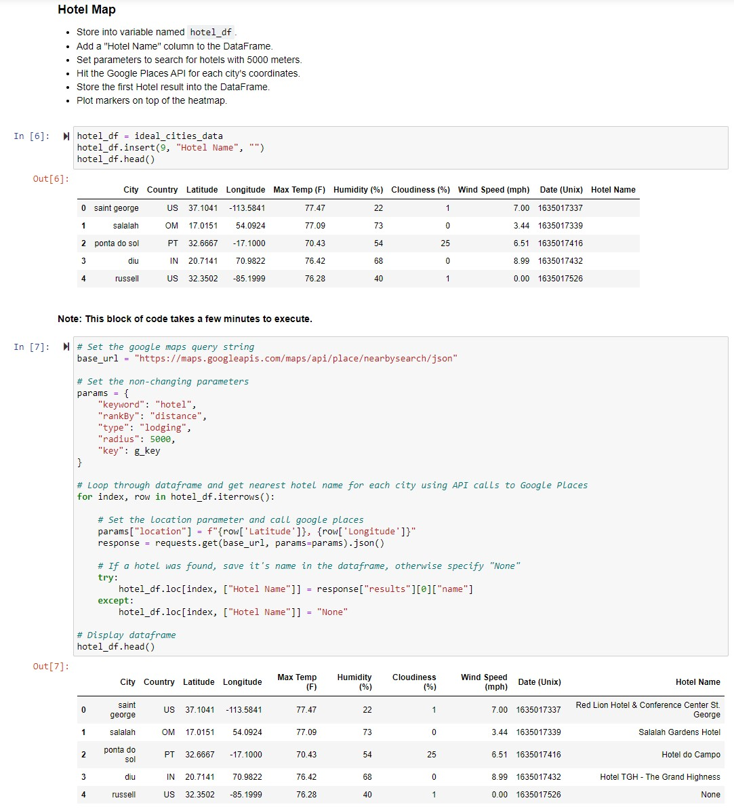
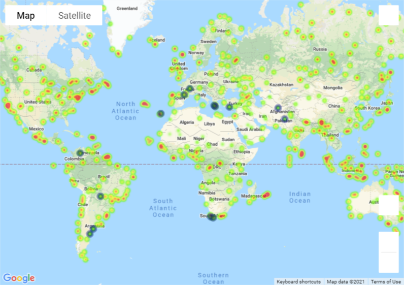
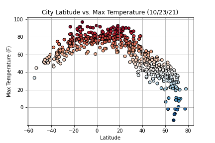
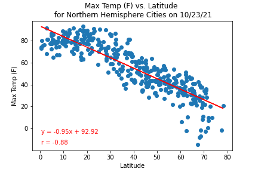

<h1> WeatherPy and VacationPy   (Two Examples of Using API Calls in Python) </h1>

### Overview: 

"WeatherPy.ipyng" first generates a list of at least 500 cities around the world that are relatively evenly spaced apart.
It then uses the OpenWeatherMap API to retrieve the temperature, cloudiness, humidity, and wind speed for each of these cities.
Pandas and Matplotlib are then used to analyze the relationship (if any) of these weather conditions to the cities' latitudes.

"VacationPy.ipynb" uses the weather data that was gathered by "WeahterPy.ipynb" to generate a list of cities around the world with favorable weather conditions.
It then uses the Google Places API to find a hotel in each of these cities and shows their locations on a map.

A website has been created that contains the results of WeatherPy's analysis:  
https://rickmora98.github.io/Web-Design-Challenge/

To examine the code files, their locations are indicated in the tree below.

### Files/Folders:

+ **"Code"** (folder containing code files and output)  
  - **"output_data"**  (folder containing csv files and graphic files output from "WeatherPy" and "VacationPy")  
  - *"api_keys.py"* (you will need to create this file to contain your API keys for OpenWeather and Google Maps)  
  - *"WeatherPy.ipynb"* (gets and analyzes weather for random cities around the world)  
  - *"VacationPy.ipynb"* (uses the weather data from "WeatherPy" to map hotels in favorable locations)  

(Please do not delete, move, rename, or alter!)

### Note:

> "WeatherPy" must be run first before running "VacationPy" as it must create a csv file that is needed by "VacationPy".  
> Both "WeatherPy" and "VacationPy" have blocks of code that take a few minutes to complete.  
> You will need to put your API keys from OpenWeather and Google Maps into a file named **api_keys.py** in the same directory as the code files.  

### Code Samples:

### Output Samples:

